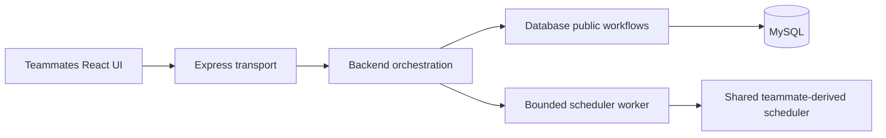

# Backend architecture and code walkthrough

[Backend home](../README.md) · [Schema](schema.md) · [Requirements](requirements.md)

## Layer boundaries

- `backend/src/l0_axioms`: request constraints and typed API errors; no I/O.
- `backend/src/l1_building_blocks`: configuration, cursor signatures, security middleware and generic worker lifecycle.
- `backend/src/l3_diplomacy`: catalogue/scheduler coordination, saved-selection reconstruction and guest-session HTTP coordination. Calls the database and scheduler public interfaces; no SQL.
- `backend/app.js`, `backend/server.js`, and `backend/http/routes.js`: composition/lifecycle and transport entrypoints. These intentionally sit above the layers. They preserve the merged frontend's GET/POST contract.
- `backend/database/l0_axioms`: source-row interpretation and DTO mapping. `l1_building_blocks`: workbook/SQL mechanisms. `l2_workflows`: snapshots, imports and persistence. `backend/database/public.js` is the public L2 facade.
- `scheduler/l0_axioms`: time, identity and v2/v3 normalization. `l1_building_blocks`: conflict predicates, candidate groups and retained v3 scoring. `l2_workflows`: resumable backtracking. `scheduler.js`, `validate.js`, `export.js` and `worker.js` are public entrypoints.

Imports must not point upward or form cycles. Cross-module orchestration uses public interfaces. New backend sources stay below 200 lines; documentation is split by responsibility. The existing App.jsx and unmodified styles.css have explicit continuity exceptions in .four-layer-audit.json. Root composition files are not mislabeled as L0. OpenAPI JSON and lockfiles are generated/declarative outputs, so their size is not a source-line exception; the API generator remains below the source budget. Original proposal/source files are preserved, not repaginated.

## Follow one request

1. Express validates the HTTP payload and normalizes term/course identifiers.
2. The database facade reads the requested courses/sections/meetings in one repeatable-read snapshot.
3. The backend rejects missing/unoffered courses and malformed catalogue data.
4. It verifies any cursor against the normalized request and catalogue fingerprint.
5. A worker resumes the shared backtracking traversal. Time and node budgets protect the HTTP event loop.
6. The backend signs continuation state and returns JSON, including completeness and unknown-data warnings.

Guest saving resolves section keys through the same catalogue workflow and checks section multiplicity, parents and conflicts. A random cookie authenticates a browser capability, not a named HKU person. Only its SHA-256 hash is stored. Every saved record query is scoped to the guest owner; another guest sees 404.

## Explain during your interview

Be able to trace a request, explain why dates and adjacent intervals matter, show a rollback test, demonstrate why an unsigned cursor is unsafe, and distinguish unknown seats from available seats. Understand these changes before choosing what to commit. This code is AI-assisted and is not evidence of independent student authorship or a successful team presentation.
