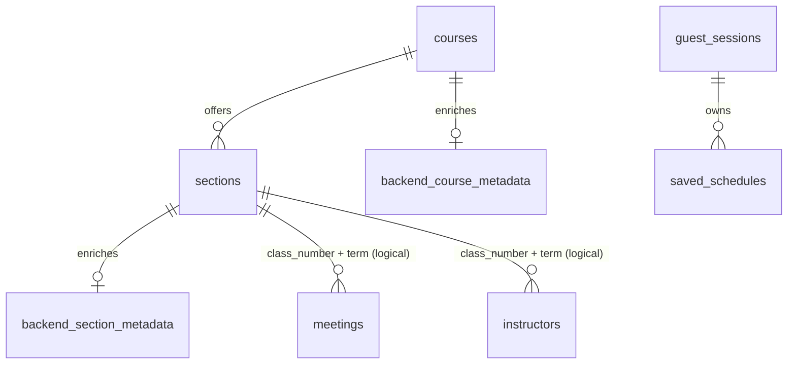

# Schema and identity

[Home](../README.md) · [Database handoff](database-handoff.md)

The original four-table schema is preserved. New backend tables are additive, not replacements.

Original meetings/instructors have no SQL foreign key to sections. The importer validates and reconciles those logical joins transactionally; tests explicitly check for orphans. We did not silently claim or add a legacy FK. Section IDs stay stable; saved selections instead use term + course + section code so they do not depend on import-order IDs.

`backend_course_metadata` has a course-code FK and nullable verified credits. `backend_section_metadata` has a section-ID FK, active flag, CLASS default, optional parent/type/campus/seat/waitlist enrichment. Missing metadata means an existing legacy section is active with unknown enrichment; import explicitly marks missing sections inactive.

`guest_sessions` stores UUIDs, unique SHA-256 token hashes and expiries. `saved_schedules` references its owner, stores term/name/section-key JSON/blocked-time JSON and timestamps, and indexes owner + schedule ID. No guest bearer token is stored. Saves deliberately have no course/term FK: stale selections must survive a catalogue change for a meaningful 409 response.

`terms` keeps imported term/date metadata. Available terms are read from active legacy sections/meetings. `catalog_imports` records committed source hash/counts and cursor revisions. `backend_migrations` records additive migration checksums.

No login/password table, share token or institutional credential collection is included. Retention/cleanup of expired sessions can be added later with explicit policy; this version does not automatically delete old saves.
